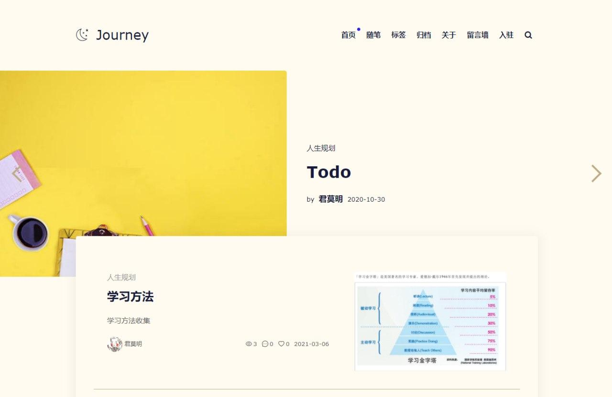

# blogNuxt
>项目背景：个人博客

项目基于nuxt

可以通过访问 https://blog.renserve.com 预览。

# 博客界面


[blog-avue](https://github.com/renserve/blog-avue)

## 前端
[blog-nuxt](https://github.com/renserve/blog-nuxt)

## 后台
[blog-koa](https://github.com/renserve/blog-koa)


## Run
``` bash

# 安装依赖
npm install

# 查看package.json script运行命令
npm run dev

```
### 参考项目
[smile-blog-nuxt](https://github.com/smileShirmy/smile-blog-nuxt)
